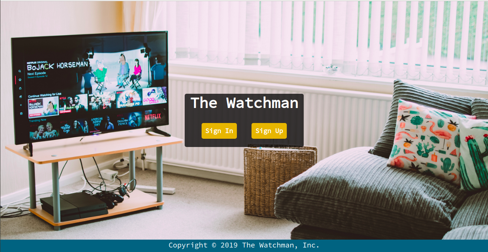

# The Watchman


[The Watchman](https://the-watchman.herokuapp.com/) is a multi-user TV show discussion application.

## Table of Contents

1. [Getting Started](#getting-started)
2. [Technology](#technology)
3. [Installation](#installation)
4. [Features](#features)
5. [Contributing](#contributing)
6. [Author](#author)
7. [License](#license)

## Getting Started

Initial software environment conditions

* Version Manager - [RVM](https://rvm.io)
* Package Manager - GEMS (Installed with Ruby)
* Code Editor - [VS Code](https://code.visualstudio.com/), [Atom](https://atom.io/), [Sublime Text](https://www.sublimetext.com/), etc.
* Operating System - MAC OS, Windows or any Linux Distro
* Modern Browser - [Google Chrome](https://www.google.com/chrome/) or [Firefox](https://www.mozilla.org/en-US/firefox/new/)

## Technology

**_PostgreSQL_**: SQL database used to store user, posts and comments <br>
**_Sinatra_**: Ruby-based microframework to create server, connect to database and serve up dynamic HTML <br>
**_Active Record_**: Relational database object-relational mapper for sinatra framework <br>
**_CSS_**: Application-level styling and customization <br>
**_JavaScript_**: Application UI functionality <br>

## Installation

* Install [RVM](https://rvm.io)

```bash
$ gpg2 --recv-keys 409B6B1796C275462A1703113804BB82D39DC0E3 7D2BAF1CF37B13E2069D6956105BD0E739499BDB

$ \curl -sSL https://get.rvm.io | bash -s stable
```

* Install Ruby

```bash
$ rvm install ruby-2.5.3

$ rvm use ruby-2.5.3
```

* Install Bundler

```bash
$ gem install bundler --no-rdoc --no-ri
```

* Install Remaining Tech Stack

```bash
$ gem install pg sinatra activerecord sinatra-activerecord
```

## Features

* Authentication
* Posting
* Commenting

## Contributing

Pull requests are welcome. Please read [CONTRIBUTING.md](https://github.com/bryanjeanty/the-watchman/blob/master/CONTRIBUTING.md) for more details.

## Author

* **Bryan Jeanty**

## License

[MIT](https://github.com/bryanjeanty/the-watchman/blob/master/LICENSE.md)
